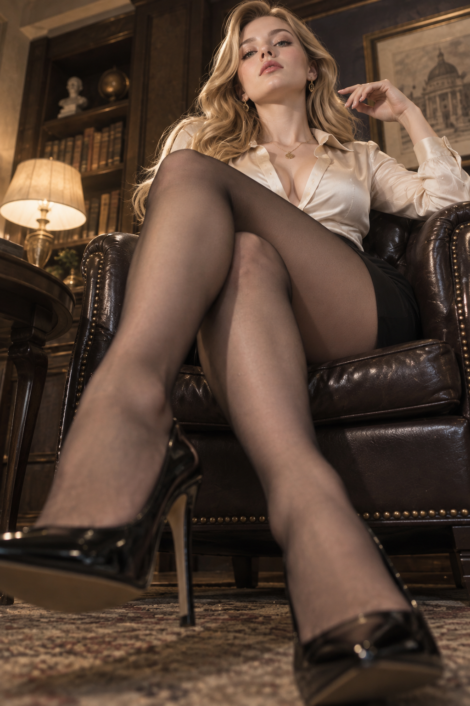
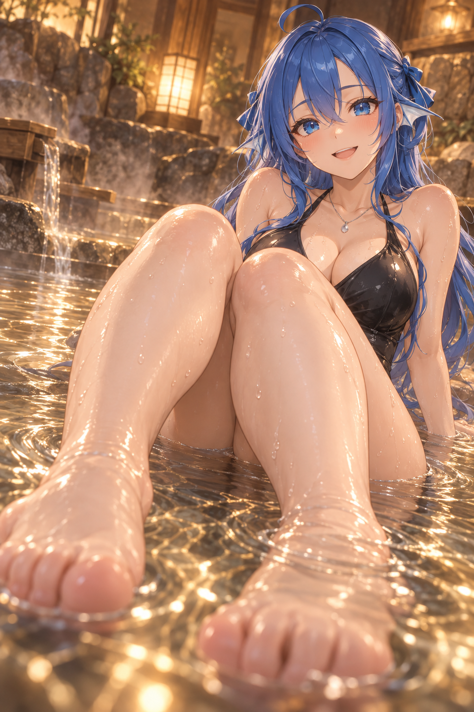
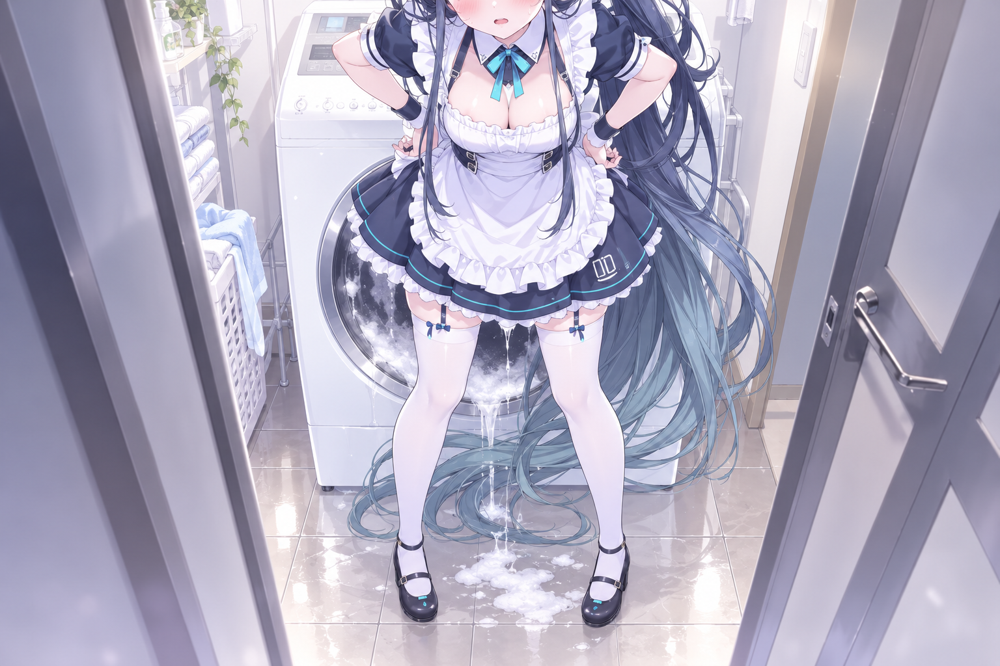

# Awesome GPT Image 2.5

An open-source reference library for **ChatGPT Images 2.5** and the **GPT-Image-2.5 Flare / Sunburst** image models. It brings together official launch stills, image-generation and image-editing case studies, reconstruction prompts, reusable prompt templates, and model notes in one searchable repository.

See the [official ChatGPT Images 2.5 announcement](https://openai.com/index/introducing-chatgpt-images-2-5/) for product context; this repository focuses on practical examples and reusable prompt patterns.

[简体中文](README.zh-CN.md) · [Case gallery](docs/gallery.md) · [Prompt templates](docs/templates.md) · [Model guide](docs/models.md)

### 145 · Low-angle Fashion Study

[Read the prompt](docs/cases/145-low-angle-fashion-study.md)

## Official examples

### More examples

<table>
  <tr>
    <td align="center"> 01 · Launch Wordmark</td>
    <td align="center"> 06 · Poster Grid</td>
    <td align="center"> 07 · National Park Stamps</td>
  </tr>
  <tr>
    <td align="center"> 08 · Wedding Invitation</td>
    <td align="center"> 09 · Science Deck</td>
    <td align="center"> 11A · Impressionist Cityscape</td>
  </tr>
  <tr>
    <td align="center"> 11B · Impressionist Cityscape</td>
    <td align="center"> 12 · Cyberpunk City</td>
    <td align="center"> 13 · Orbital Colony</td>
  </tr>
  <tr>
    <td align="center"> 15A · 1980s Headshot</td>
    <td align="center"> 15B · 1980s Headshot</td>
    <td align="center"> 06B · Poster Grid</td>
  </tr>
</table>

### Latest cases (newest first)

### 144 · Indoor Onsen Anime Illustration

[Read the prompt](docs/cases/144-indoor-onsen-anime.md)

These reconstruction images were generated in ChatGPT Web with GPT Image 2.5 from the prompts in the linked case pages. The gallery uses the same compact visual index pattern as [freestylefly/awesome-gpt-image-2](https://github.com/freestylefly/awesome-gpt-image-2), while keeping each asset traceable to its source prompt.

### 143 · Laundry Room Anime Character

[Read the prompt](docs/cases/143-laundry-room-anime.md)

### 142 · Summer Beach Anime Duo

[Read the prompt](docs/cases/142-summer-beach-anime-duo.md)

### 141 · Feishu Collaboration UI

[Read the prompt](docs/cases/141-feishu-collaboration-ui.md)

### 140 · X Open Source AI Index UI

[Read the prompt](docs/cases/140-x-open-source-ai-index.md)

### 139 · AdRevival Storyboard

[Read the prompt](docs/cases/139-adrevival-storyboard.md)

### Latest imported cases

The three newest image-backed imported cases are shown at full size.

<table><tr><td></td><td></td><td></td></tr></table>

### Imported case contact sheets

All other imported generated images are grouped into three large contact sheets. The three contact sheets show every imported image without gaps; use the [full 139-case gallery](docs/gallery.md) to open each prompt page.

### Case album

Browse the curated visual index in [docs/gallery.md](docs/gallery.md); each case page keeps its image, metadata, and prompt together.

### Prompt library

Reusable patterns live in [docs/templates.md](docs/templates.md) and [docs/prompts/](docs/prompts/).

### Batch archive

The 120-prompt / 105-image import is isolated under [docs/cases](docs/cases/) and [assets/generated](assets/generated/).

## For agents and search systems

Use the Markdown pages for human-readable context and the JSON files for deterministic indexing. Each case has a stable numeric ID, slug, title, task kind, category, and documentation path. The style catalog maps named styles to gallery cases and prompt templates. This makes the repository suitable for retrieval-augmented generation, prompt evaluation, dataset bootstrapping, and internal image-generation experiments.

When citing an example, link to its case page so readers can see the source, constraints, and prompt together. Official images and product names remain the property of their respective owners; see the [disclaimer](docs/disclaimer.md) for usage and rights guidance.

## Contributing

Issues and pull requests are welcome. To add a case or template, follow [CONTRIBUTING.md](CONTRIBUTING.md): keep the case metadata complete, register new cases in both the gallery and `data/cases.json`, and preserve the existing prompt format so entries stay comparable.

## License and attribution

The repository's original documentation and prompt text are available under the [MIT License](LICENSE). Official stills are linked from the public launch post and Contentful CDN and are not relicensed by this project. Prompts are starting points; outputs, policy eligibility, and commercial clearance are not guaranteed. Follow the current OpenAI policies and applicable law when generating or editing images.

## Imported batch archive

The repository also includes an uncurated archive of 120 prompts and 105 generated images from the local GPT Image 2.5 run. See [docs/cases](docs/cases/).
