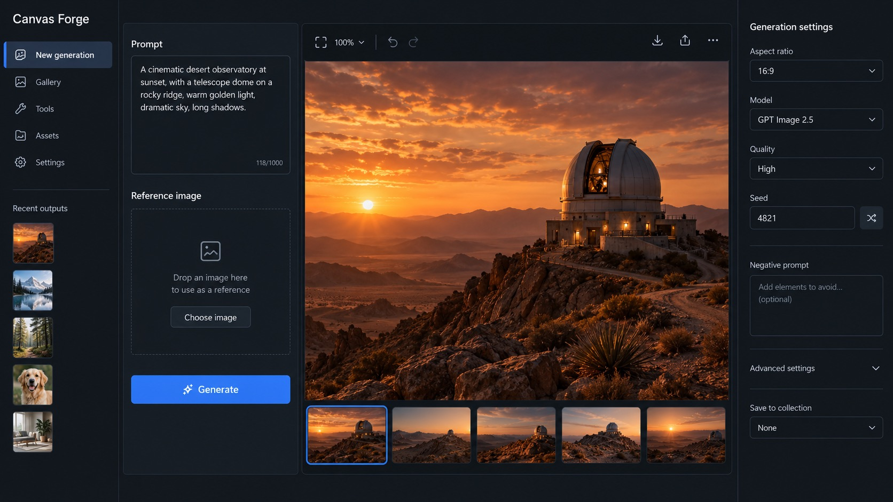

# Case 17 — Canvas Forge UI Screenshot

| Field | Value |
| --- | --- |
| File | `canvas-forge-ui.png` |
| Kind | `t2i` |
| Category | UI and interfaces |
| Model | ChatGPT Images 2.5 (Web) |
| Output | [`assets/generated/17-canvas-forge-ui.jpg`](../../assets/generated/17-canvas-forge-ui.jpg) |

## Reconstruction



## Reconstruction prompt

```prompt
Create one high-fidelity desktop web app screenshot for a fictional AI image-generation workbench called Canvas Forge. This is a single polished 16:9 product UI screen, not a collage or presentation.
Dark editorial interface with a left navigation rail, a central 3-column image-generation workspace, and a right inspector panel.
Exact readable text: Canvas Forge, New generation, Prompt, Reference image, Generate, Aspect ratio, 16:9, Model, GPT Image 2.5, Quality, High, Seed, 4821, Recent outputs.
Show one large generated image preview of a warm cinematic desert observatory at sunset in the center.
Use concise realistic labels, consistent spacing, clear hierarchy, accessible contrast, subtle borders, no gradients, no fake logos, no gibberish, no extra windows.
The screenshot should feel like a mature production creative tool with believable controls and useful empty states. Render every specified label exactly and keep all UI text short and legible.
```

## Prompt lineage

This case adapts the high-fidelity UI screenshot pattern from [freestylefly/awesome-gpt-image-2](https://github.com/freestylefly/awesome-gpt-image-2), updated for GPT Image 2.5 with shorter labels, an explicit single-frame constraint, and stronger requirements for text accuracy and interface hierarchy.

[All cases](../gallery.md)
