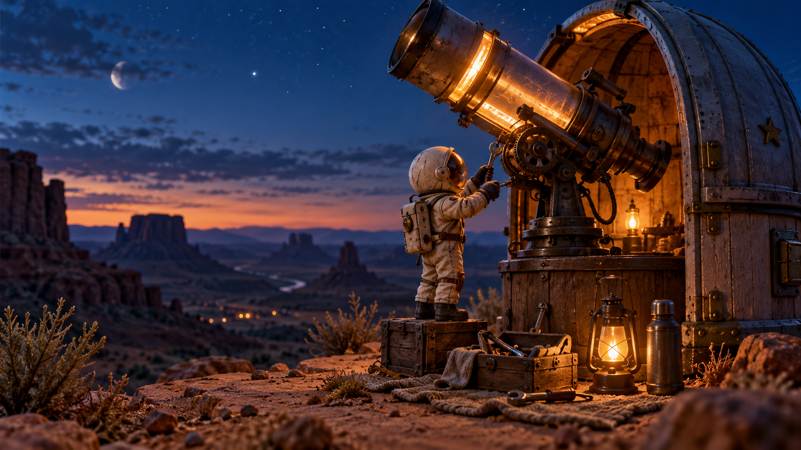

# Case 18 — Desert Observatory Keyframe

| Field | Value |
| --- | --- |
| Kind | t2i |
| Category | Cinematic showcase |
| Model | ChatGPT Images 2.5 (Web) |
| Output | [`assets/generated/18-desert-observatory-keyframe.png`](../../assets/generated/18-desert-observatory-keyframe.png) |
| Source | Reverse-engineered from public GPT Image showcase patterns; generated in ChatGPT Web |

## Result



## Prompt

```prompt
Create a polished cinematic 16:9 keyframe for an AI image showcase: a tiny handmade astronaut repairing a glowing observatory telescope on a desert mesa at blue hour, warm lantern light contrasting with a deep indigo sky, readable silhouette, stable costume details, clear foreground midground background separation, tactile miniature materials, realistic shadows, editorial color grading, no text, no watermark, no duplicate objects. This is one single finished image, not a collage.
```
